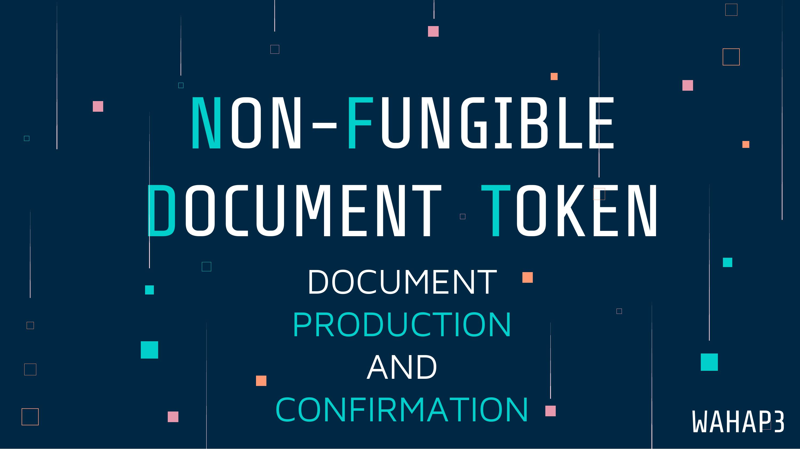
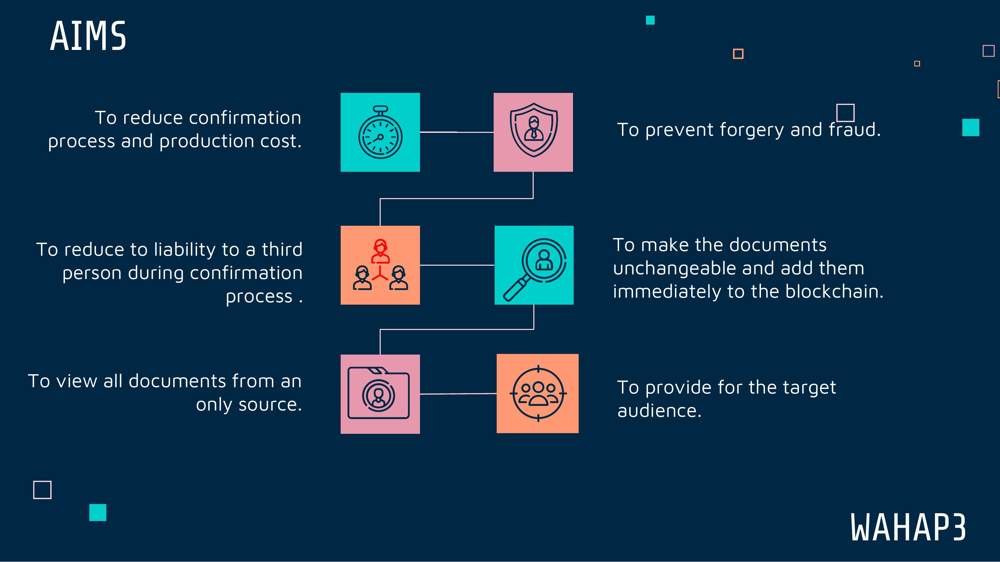
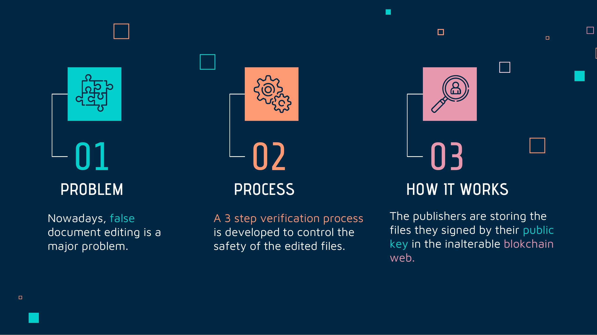
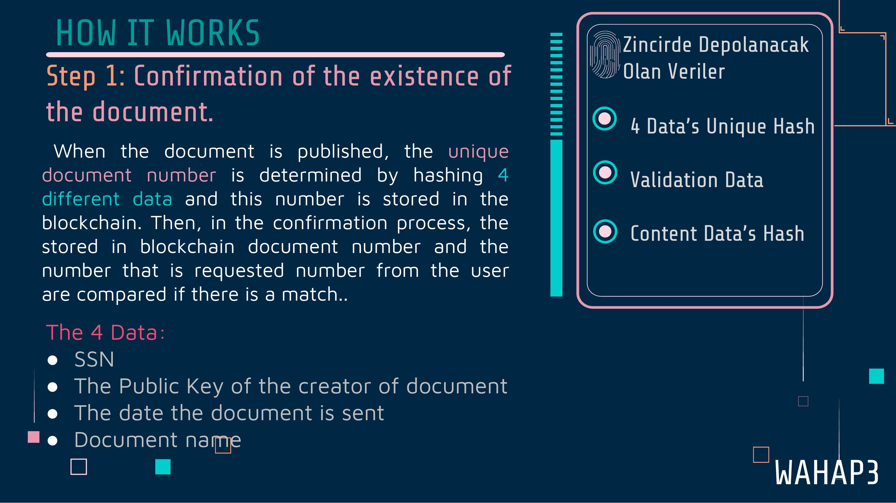
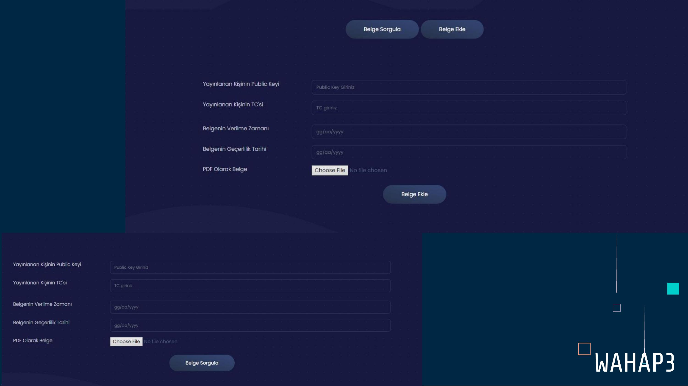
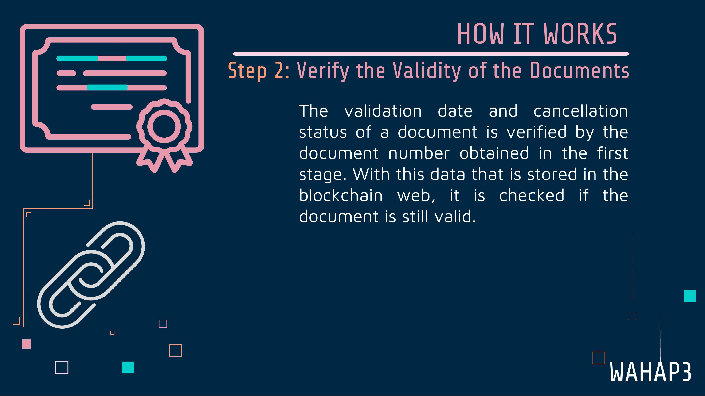
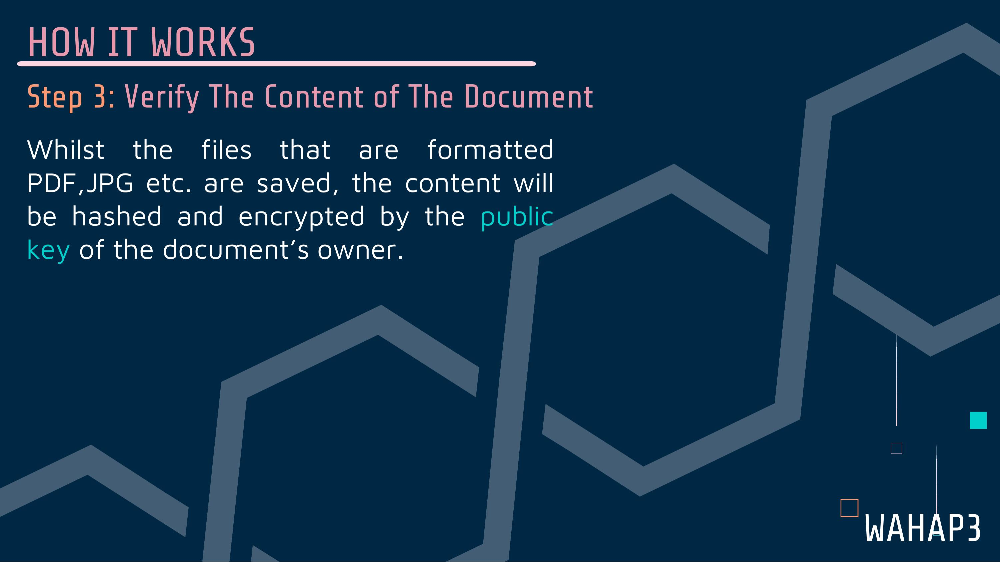
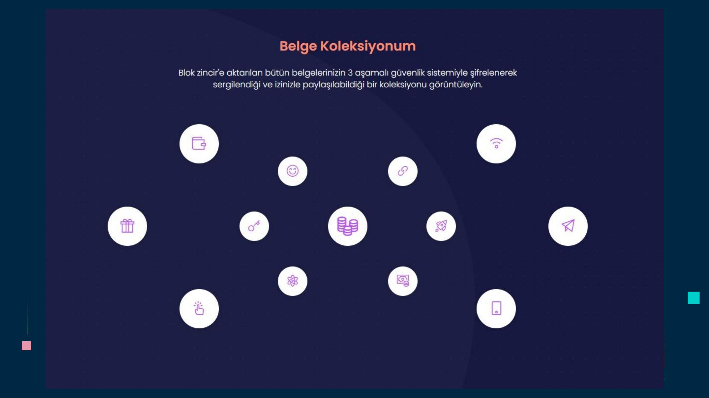
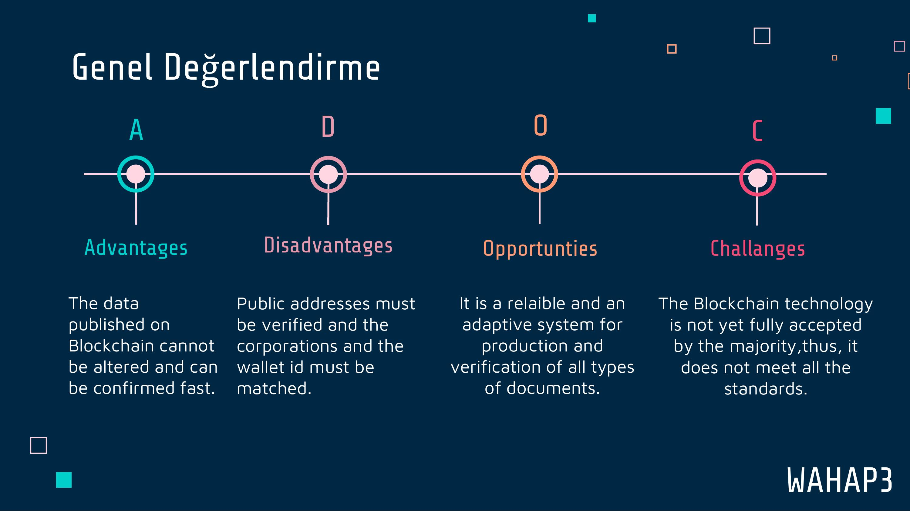
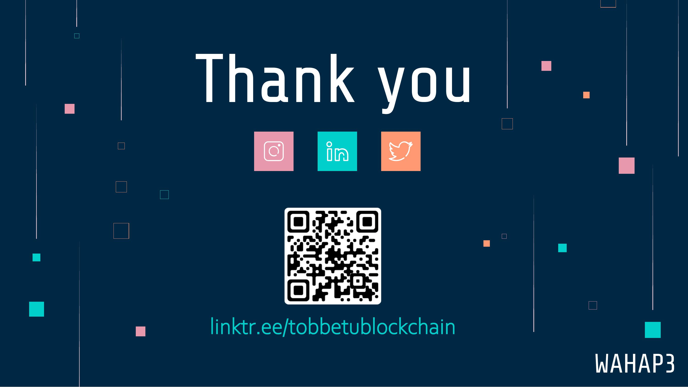

---Finalist of Digiathon 2022---
   
Team: WAHAP3
   
Team Members:    
Hüseyin PEKKAN - AI Engineering - @hpekkan  
Muhammed Ata Turhan AI - Engineering - @fotino21 
Berkay Yıldız Computer - Engineering - @berykay 
Harun Serkan Metin Computer- Engineering -@HarunSMetin 
   
  ## DEMO VIDEO 
         

Run project on local:    
-npm install --force    
-npm start    

## 
Project Presentation

